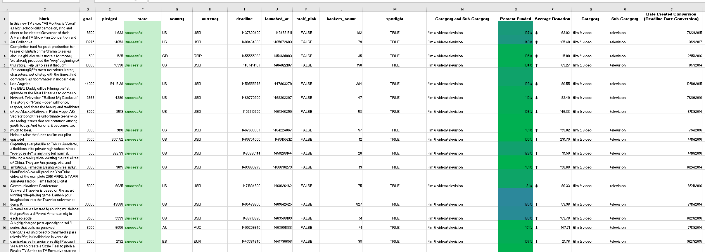
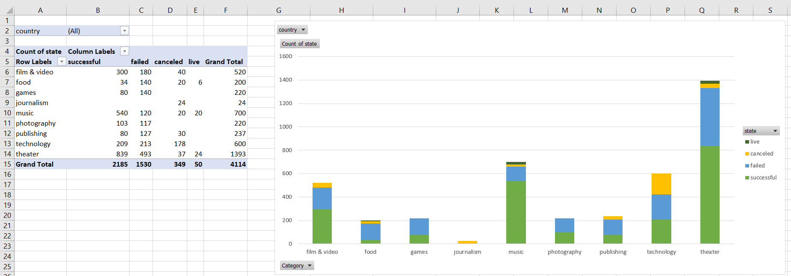

# Excel-Basics

Author:  Erin James Wills, ejw.data@gmail.com  - 8/24/2019

<cite>Photo by [micheile dot com](https://unsplash.com/@micheile?utm_source=unsplash&utm_medium=referral&utm_content=creditCopyText) on [Unsplash](https://unsplash.com/s/photos/money?utm_source=unsplash&utm_medium=referral&utm_content=creditCopyText)</cite>

 

## Overview  

Using a sample dataset from 2017, a quick analysis was performed in Excel.  Part of the analysis was to format and modify the sheet to indicate which campaigns were successful.  The dataset was only a small sampling with less than 4,200 rows but the breadth of the data accomodated a variety of analyses using Pivot Charts and Pivot Tables. 

 

## Methods
*  Binning
*  Aggregating
*  Ranking
*  Trending  

 

## Technologies  
*  Excel: Pivot Tables, Pivot Charts

 

## Data Source
The origins are unknown.  The type of data matches what is on [Kickstarter.com](https://kickstarter.com) but 4,200 records is very small considering current campaigns (500,000 in 2022).  A validated dataset should be obtained for a more serious analysis.  

  

## Future Work  
This analysis was helpful as a cursory review but in the future I think that data from [Web Robots](https://webrobots.io/kickstarter-datasets/) could be used to get the same features but in much greater detail over time.  The **Web Robots** webpage has monthly webscrapes of the data from 2016 to now.

 

## Data Prep (Tab 1)

*  The state column (Column F) is color coded as the following:
   *  Green Text and Light Green Background Color are ‘successful’ cases
   *  Orange Text and Yellow Background Color are ‘canceled’ cases
   *  Red Text and Light Red Background Color are ‘failed’ cases  
*  Dates were parsed and text was extracted into new columns to make category labels  
*  The last two columns were modified to include info to better define the heading.  ‘Date created’ and ‘Date ended’ don’t really match the type of data in the column – its campaign launched and campaign deadline.  

 

## Analysis (Tabs 1,2,3)

 
*  Most of the data is from the US (~75%) and the key categories driving Kickstarter campaigns varies from country-to-country.  It is pretty common for theater to be one of the key campaigns.  The first table indicates that the arts theater and music have had significant success (by volume and success rates) when using kickstarter.  
*  Of the subcategories, plays are the most common type of campaign particularly in GB, AU, and the US.  Other areas like publishing have not done very well with only certain subcategories having any success (nonfiction and radio/podcasts for US data).  This could mean that funding could be highly specific for the type of subcategory but since I am only looking at the total counts and not including the amount being asked this could be very misleading as to why difference categories failed.   
*  The business began greater volume after April 2014 so something different occurred during this time period so analysis of the data should be compared before and after the event to see if it is comparing apples to oranges.  It seems as if there was more consistent success stories over failed campaigns before April 2014.  
*  Knowing when the majority of the donations came in would be very helpful – meaning is success based on the initial donations in the first few days or consistent donations over the length of the campaign.  Also, knowing how they advertised their kickstarter is very important to knowing why people donated.  *  It would also be helpful to analyze who were the donors – were they local, random, one or two major donors or many small donations.  I would not use this data for countries that had small datasets – I think the US, AUS, and GB had fairly large numbers with the US out numbering all other campaign locations.   
*  I would create more graphs that span over time – meaning I would compare success/failures by category/subcategory with all years shown on one bar graph because it seems as if the campaign type popularity probably changed over the course of the ~9 years and potentially the behavior of success and failures were influenced by the total donors versus the total campaigns (dilution) when viewed across multiple years.   
*  I would also look at success versus failed and canceled combined or similarly compare success versus total.  I would also create a table showing country involvement – there are significant differences when looking at country to country data.  I would only use this dataset to analyze US trends because the other country’s datasets are much smaller.

 
 

